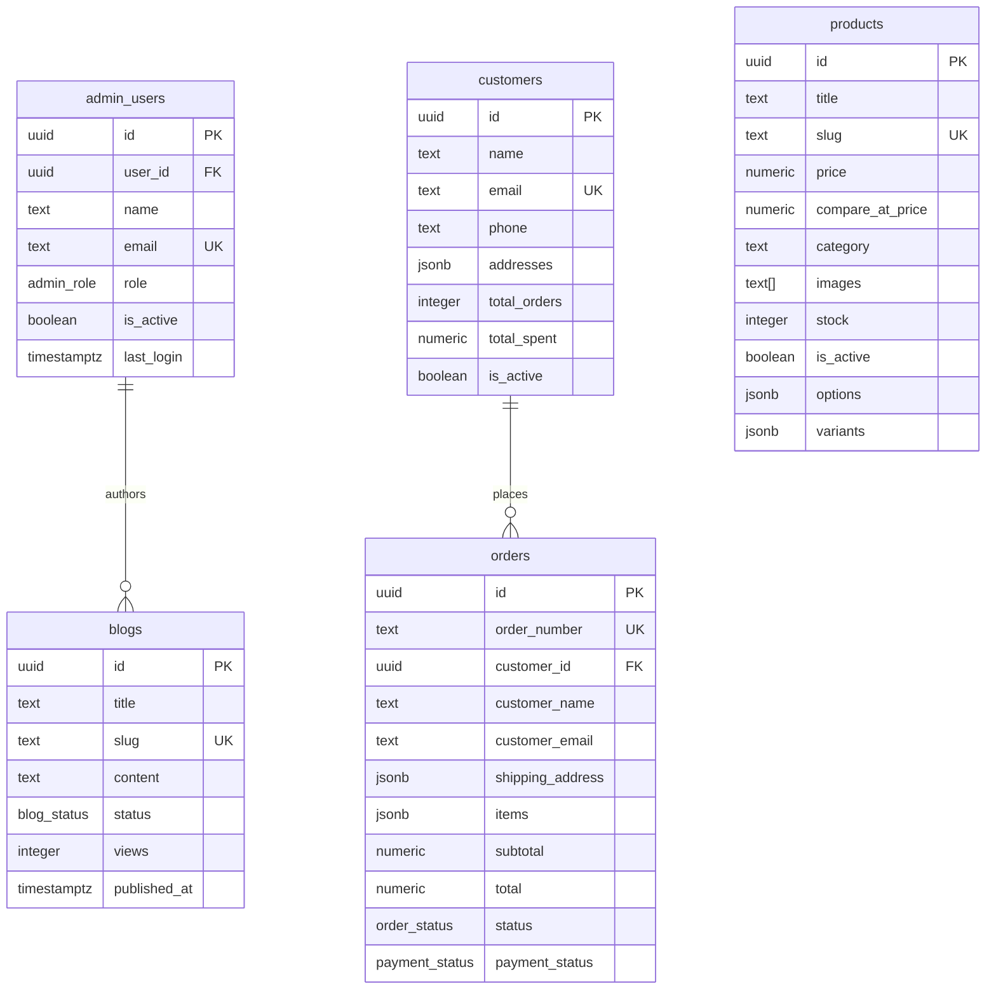

# ⚜️ Divine Interior

> **Divine Interior** is a luxury e-commerce platform and management studio tailored for premium home interior furnishings, modular kitchens, wardrobes, and designer furniture. Crafted with a premium aesthetic, smooth micro-animations, and a highly responsive design, it offers a seamless shopping experience for clients and a full-featured administration dashboard ("Studio") for operators.

---

## 🚀 Live Links & Project Info
- **GitHub Repository**: [highbizz/divine-interior](https://github.com/highbizz/divine-interior)
- **Deployment Status**: Active & Production-Ready
- **Primary Tech Stack**: React (TypeScript), Vite, Tailwind CSS, Supabase (PostgreSQL), Zustand, TanStack Query

---

## 🛠️ Tech Stack & Implementation Details

Divine Interior is built using a modern, scalable, and type-safe architecture:

### Frontend
- **Framework**: [React 18](https://reactjs.org/) + [Vite](https://vitejs.dev/) for extremely fast development cycles and optimized builds.
- **Language**: [TypeScript](https://www.typescriptlang.org/) for compile-time safety and self-documenting codebases.
- **Styling**: [Tailwind CSS](https://tailwindcss.com/) for fluid utility classes.
- **UI Components**: [Shadcn UI](https://ui.shadcn.com/) (Radix UI primitives) customized with a rich, dark/gold luxury theme.
- **Animations**: [Framer Motion](https://www.framer.com/motion/) for premium micro-animations, slide-ins, and state transitions.
- **Icons**: [Lucide React](https://lucide.dev/) for a clean, modern icon library.
- **Data Visualization**: [Recharts](https://recharts.org/) for beautiful, responsive charts in the Admin Dashboard.

### State & Data Management
- **Global Store**: [Zustand](https://github.com/pmndrs/zustand) for client-side state management (Cart Drawer open/close state, customer authentication context, and administrative sessions).
- **Cart Synchronization**: Custom hook `useCartSync` that guarantees offline-first cart saving to local storage and real-time syncing when customers log in.
- **Server State**: [TanStack React Query (v5)](https://tanstack.com/query/latest) for robust caching, refetching, loading states, and mutations from the database.

### Backend & Infrastructure
- **Database**: [Supabase](https://supabase.com/) (PostgreSQL) hosting relational data.
- **Database Logic**: Custom triggers, automated timestamps, sequence generators (e.g. customized invoice generation), and transactional procedures.
- **Security**: Strict Postgres Row-Level Security (RLS) policies protecting client, product, order, and admin data.

---

## 📐 Folder Architecture

```text
├── .github/             # GitHub workflow files
├── api/                 # Serverless API routes (if applicable)
├── public/              # Static assets (images, logos, icons, robots.txt)
├── src/
│   ├── assets/          # Project images, high-res catalog photos, and media
│   ├── components/      # Reusable React components
│   │   ├── admin/       # Components specifically for the Admin Dashboard
│   │   └── ui/          # Generic custom UI components (Shadcn/Radix components)
│   ├── hooks/           # Custom React hooks (e.g., useCartSync, useMobile)
│   ├── lib/             # API clients, helpers (Supabase client configuration)
│   ├── pages/           # View pages mapping directly to client routes
│   │   ├── account/     # Customer account view directories (Profile, Orders, Addresses)
│   │   └── admin/       # Studio Dashboard control center views
│   ├── stores/          # Zustand global stores (adminStore, cartStore, customerStore)
│   ├── test/            # Unit testing setup and test cases
│   ├── types/           # Global TypeScript interfaces and Database declarations
│   ├── App.tsx          # Application router, guards, and main layout container
│   ├── index.css        # Core global styles, fonts, scrollbars, and tailwind root rules
│   └── main.tsx         # Application entry point
├── supabase/
│   └── schema.sql       # Complete PostgreSQL database schema definition
├── tailwind.config.ts   # Configuration for variables, custom color palettes, and fonts
├── tsconfig.json        # TypeScript compiler configurations
├── vite.config.ts       # Build and plugin details for Vite
└── vitest.config.ts     # Settings for the test suite runner (Vitest)
```

---

## 🗄️ Database Schema & Relational Study

The database is built on **PostgreSQL** via Supabase. Below is a relational overview of the core schema:



### Table Details:
1. **`products`**: Stores details of catalog items, supporting customizable product variations (`variants` JSONB) and options (e.g., sizes, wood textures, fabrics).
2. **`customers`**: Stores profile information, shipping addresses, and metrics like lifetime value (`total_spent`) and engagement history.
3. **`orders`**: Handles sales records, storing snapshot data of line-items purchased (retaining prices at the time of purchase), shipment details, and fulfillment statuses.
4. **`blogs`**: Drives the site's Content Management System (CMS), storing article copies, metadata for SEO optimizations, and analytics counters.
5. **`admin_users`**: Associates specific authenticated users from Supabase Auth (`auth.users`) to custom roles (`super_admin`, `admin`, `editor`, `viewer`), restricting administration control.

---

## 🔒 Security & Row-Level Security (RLS)

All tables strictly enforce **Row-Level Security (RLS)** in PostgreSQL. This guarantees that unauthorized users cannot read or write to private tables.

### How RLS is configured in this system:
* **Admin Guard Function**:
  ```sql
  create or replace function is_admin()
  returns boolean language sql security definer as $$
    select exists (
      select 1 from public.admin_users
      where user_id = auth.uid()
        and is_active = true
    );
  $$;
  ```
* **Products Policy**:
  * Public users can query only active products (`is_active = true`).
  * Admin accounts have full permissions (INSERT, UPDATE, DELETE).
* **Orders Policy**:
  * Enforced so that only active admins can read/write global orders.
  * *Extension ready*: Customers can view only their own orders (`customer_id = auth.uid()`).
* **Customers Policy**:
  * Sensitive customer metadata is shielded from the public, accessible only to authenticated admins and the customer themselves.

---

## ✨ Features Showcase

### 🏬 Elegant Storefront
* **Luxury Branding Theme**: A tailored color palette utilizing obsidian black, warm golds, and ivory tones.
* **Dynamic Search & Filters**: Live client-side product filtering by categories, price ranges, and tags.
* **Persistent Cart System**: Seamless cart item storage syncing gracefully with active accounts.
* **Frictionless Checkout**: Simple step-by-step order placement interface capturing addresses and customer notes.

### 📝 CMS & SEO Features
* **Full-Featured Blog**: Read articles on interior trends, design styles, and luxury guides.
* **SEO Optimizer**: Supports custom meta titles, meta descriptions, and clean slugs to boost Search Engine optimization ranking.

### 🛠️ Admin Dashboard ("Studio")
* **Performance Charts**: Real-time sales performance, average order value, and registration volumes mapped over time.
* **Catalog Manager**: Full CRUD workspace to upload products, set stock values, customize categories, and manage item variants.
* **Orders Control Center**: Edit order shipping details, update payment metrics, and advance shipping stages (`pending` → `delivered`).
* **Blog Publisher**: Manage, draft, edit, and publish new articles with an interactive editor interface.

---

## 🚀 Setting Up the Project Locally

### 1. Prerequisites
Ensure you have the following installed on your machine:
- [Node.js](https://nodejs.org/) (v18 or higher recommended)
- [Git](https://git-scm.com/)
- [Supabase CLI](https://supabase.com/docs/guides/cli) (optional, for local DB development)

### 2. Installation Steps
Clone the project and install all dependencies:
```bash
# Clone the repository
git clone https://github.com/highbizz/divine-interior.git
cd divine-interior

# Install package dependencies
npm install
```

### 3. Database Initialization
1. Create a project in your [Supabase Dashboard](https://supabase.com).
2. Open the **SQL Editor** in Supabase.
3. Paste the contents of `supabase/schema.sql` into the query field and click **Run**. This will create the required tables, triggers, and security configurations.

### 4. Configure Environment Variables
Create a file named `.env` in the root of the project (using `.env.example` as a template):
```env
VITE_SUPABASE_URL=your_supabase_project_url
VITE_SUPABASE_ANON_KEY=your_supabase_anon_public_key
```

### 5. Running the Application
```bash
# Run local development server
npm run dev

# Run unit tests
npm run test

# Lint code for warnings/errors
npm run lint

# Build production bundle
npm run build
```

---

## 📜 Development Guidelines

- **Component Standard**: Keep UI elements decoupled and modular in `src/components/ui`. Always use shadcn standards.
- **Type Safety**: Maintain interfaces for API contracts in `src/types`. Do not use `any`.
- **Database Safety**: Never run raw SQL updates on production without schema migration scripts. Ensure all tables have active RLS policies.
